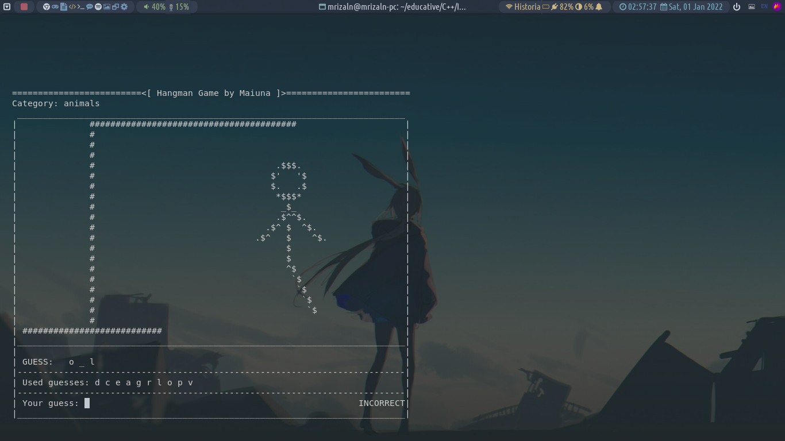
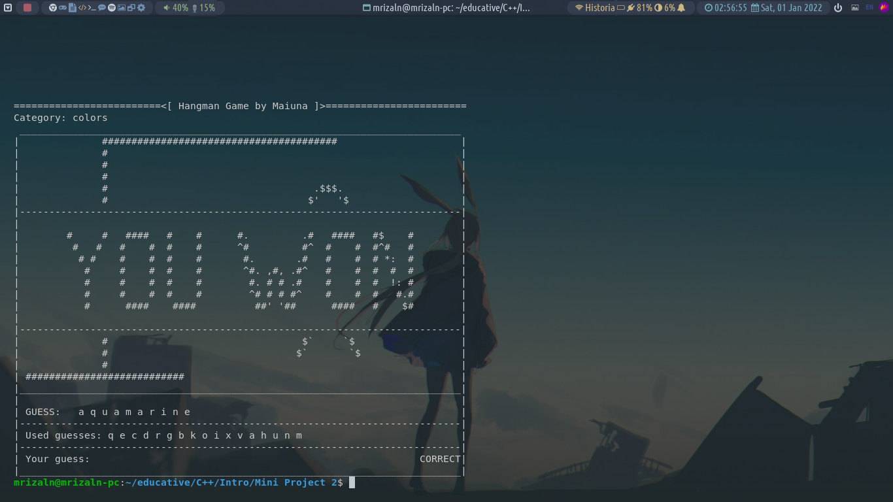

# simple-hangman-game

A simple text-based, console-based hangman game I made as a Mini Project assignment on [educative course of Introduction to C++](https://www.educative.io/courses/learn-cpp-complete-course/)

playing:

win:

lose:

