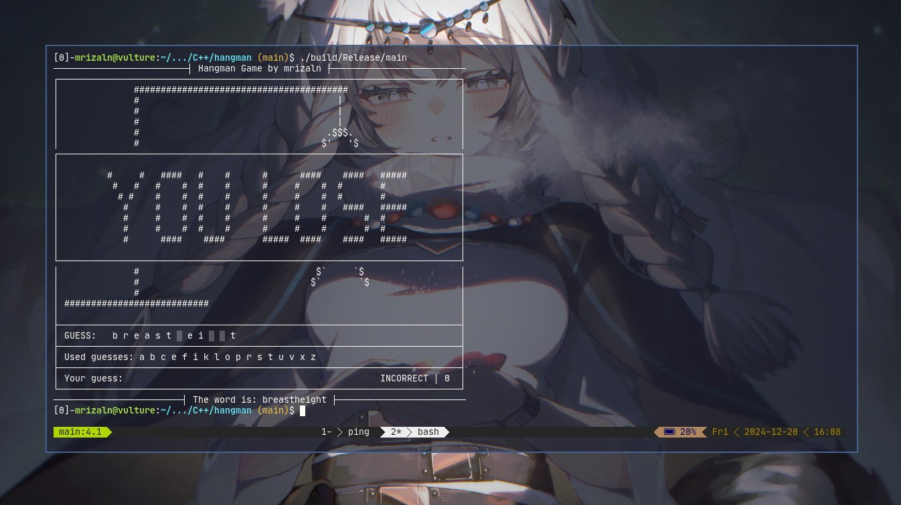

# simple-hangman-game

A simple text-based, console-based hangman game.

> I made this project as a Mini Project assignment on [educative course of Introduction to C++](https://www.educative.io/courses/learn-cpp-complete-course/), though I decide to rewrote it after a while



## Building

To compile this project, these dependencies must be installed in the system

- C++23 capable compiler
- CMake
- Conan 2 (for dependency management)

```sh
conan install . --build missing -s build_type=Release   # or Debug
cmake --preset conan-release                            # or conan-debug; use conan-default if on windows regardless
cmake --build --preset conan-release                    # same as above
```

If you want, you can omit Conan and use your system package manager to download the library dependencies instead. You should know how to build the project if you decide to do this.

## Usage

This project requires words list to be available to be ran. By default, it uses `/usr/share/dict/words` as the source. You can use a custom word list by writing the words (separated by newline) to a file then run the project with the option `--word-list <path/to/word/list/file>`. You can try harder game by using the `--hard` flag

```
Hangman game
Usage: ./build/Release/main [OPTIONS]

Options:
  -h,--help                   Print this help message and exit
  --hard                      Use hard difficulty
  --word-list TEXT [/usr/share/dict/words]
                              Path to word list
```
